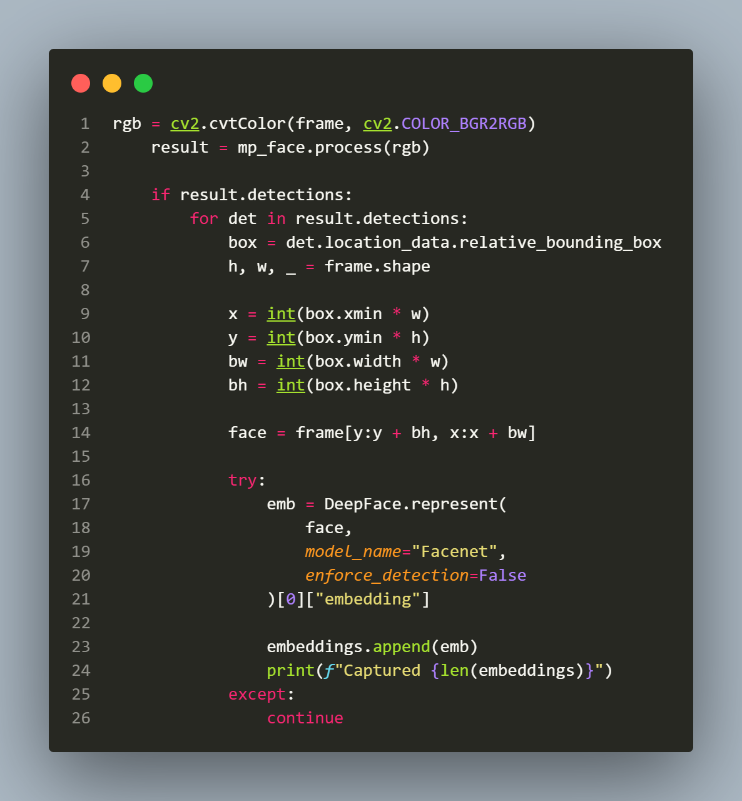
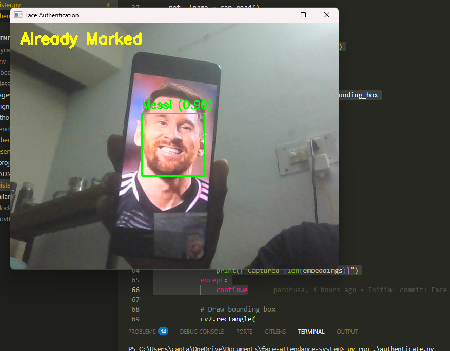
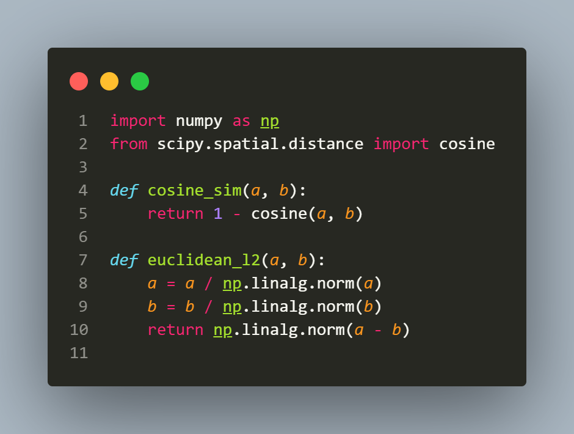

# Face Attendance System

A real-time face recognition-based attendance system built with Python, MediaPipe, and DeepFace. This system allows you to register students' faces and automatically mark their attendance using live face recognition.

## 📋 Table of Contents

- [Features](#features)
- [Technologies Used](#technologies-used)
- [Project Structure](#project-structure)
- [Installation](#installation)
- [Usage](#usage)
- [How It Works](#how-it-works)
- [Configuration](#configuration)

## ✨ Features

- **Face Registration**: Register students by capturing 10 face samples and generating embeddings
- **Live Face Recognition**: Real-time attendance marking using face recognition
- **Attendance Tracking**: Automatically saves attendance records with date and time to CSV
- **Present Students Viewer**: View currently present students using YOLO face detection
- **Duplicate Prevention**: Prevents marking the same student twice on the same day

## 🛠 Technologies Used

- **MediaPipe**: Face detection in registration and authentication modules
- **DeepFace**: Face embedding generation using Facenet model
- **YOLO (Ultralytics)**: Face detection in present students viewer
- **OpenCV**: Video capture and image processing
- **NumPy**: Numerical operations and embedding storage
- **Pandas**: CSV file management for attendance records
- **SciPy**: Similarity calculations (cosine and euclidean distances)

## 📁 Project Structure

```
face-attendance-system/
├── register.py              # Main registration script
├── authenticate.py          # Main authentication script
├── present_students.py      # Additional feature - present students viewer
├── similarity.py            # Custom similarity functions
├── embeddings/              # Directory storing face embeddings (.npy files)
├── attendance.csv           # Attendance records (auto-generated)
├── yolov8n.pt              # YOLO model weights
├── pyproject.toml          # Project dependencies
└── README.md               # This file
```

## 🚀 Installation

### Prerequisites

- Python 3.10 or higher
- Webcam/Camera access
- Internet connection (for initial model downloads)

### Setup

1. Clone the repository:
```bash
git clone <your-repo-url>
cd face-attendance-system
```

2. Install dependencies using `uv` (recommended):
```bash
uv sync
```

Or install manually using pip:
```bash
pip install deepface mediapipe==0.10.9 tf-keras pandas opencv-python scipy ultralytics
```

3. Download YOLO model (if not already present):
   - The `yolov8n.pt` file should be in the project root
   - It will be automatically downloaded on first use if missing

## 📖 Usage

### Step 1: Register Students

First, register students by capturing their face samples:

```bash
python register.py
```

**What happens:**
- Enter the student's name when prompted
- Look at the camera - the system will capture 10 face samples
- Face embeddings are generated using DeepFace Facenet model
- The average embedding is saved as `name.npy` in the `embeddings/` directory

**Screenshot/Image Placeholder:**

*[Image: register.py interface showing face detection and sample capture progress]*

---

### Step 2: Mark Attendance

Run the authentication script to mark attendance in real-time:

```bash
python authenticate.py
```

**What happens:**
- Live face detection using MediaPipe
- Face recognition every 10 frames (for performance)
- Compares detected face with registered embeddings using cosine similarity
- If similarity > 0.7 threshold: marks attendance and shows name
- If similarity ≤ 0.7: shows "Unknown"
- Attendance records are saved to `attendance.csv` with Name, Date, and Time
- Prevents duplicate entries for the same student on the same day

**Controls:**
- Press `q` to quit

**Screenshot/Image Placeholder:**

*[Image: authenticate.py interface showing live face recognition with bounding boxes and labels]*

---

### Step 3: View Present Students (Optional)

View currently present students using the additional viewer:

```bash
python present_students.py
```

**What happens:**
- Uses YOLO for face detection (instead of MediaPipe)
- Only loads embeddings of students marked present today
- Displays recognized present students with their names
- Shows "Unknown" for unrecognized faces

**Note:** This is an additional feature, not part of the main workflow.


---

## 🔧 How It Works

### Registration Process (`register.py`)

1. **Face Detection**: Uses MediaPipe Face Detection model to detect faces in the camera feed
2. **Embedding Generation**: For each detected face:
   - Extracts face region from the frame
   - Generates 128-dimensional embedding using DeepFace Facenet model
   - Collects 10 samples (iterations 0-9)
3. **Embedding Storage**: 
   - Calculates mean embedding from all 10 samples
   - Saves as `embeddings/{name}.npy` file

**Flow Diagram Placeholder:**
<!--  -->
*[Image: Flowchart showing registration process]*

### Authentication Process (`authenticate.py`)

1. **Face Detection**: Uses MediaPipe to detect faces in real-time
2. **Embedding Extraction**: Every 10 frames:
   - Extracts face region
   - Generates embedding using DeepFace Facenet
3. **Similarity Comparison**: 
   - Loads all registered embeddings from `embeddings/` directory
   - Compares using custom `cosine_sim()` function from `similarity.py`
   - Threshold: 0.7 (if similarity > 0.7, match is found)
4. **Attendance Marking**:
   - If match found: Shows name and marks attendance
   - If no match: Shows "Unknown"
   - Saves to `attendance.csv` with format: `Name, Date, Time`
   - Prevents duplicate entries for same day


### Similarity Functions (`similarity.py`)

The project includes custom similarity functions:

- **`cosine_sim(a, b)`**: Calculates cosine similarity (returns 0-1, higher = more similar)
  - Formula: `1 - cosine_distance(a, b)`
  - Used in authentication for comparing embeddings

- **`euclidean_l2(a, b)`**: Calculates L2-normalized euclidean distance
  - Normalizes vectors before calculating distance
  - Lower value = more similar

**Code Example Placeholder:**
 
*[Image: Code snippet showing similarity.py functions]*

## ⚙️ Configuration

### Key Parameters

**In `register.py`:**
- `SAMPLES_REQUIRED = 10`: Number of face samples to capture
- `min_detection_confidence = 0.6`: MediaPipe detection threshold

**In `authenticate.py`:**
- `THRESHOLD = 0.7`: Similarity threshold for face recognition (0-1 scale)
- `FRAME_SKIP = 10`: Process every Nth frame (performance optimization)
- `min_detection_confidence = 0.6`: MediaPipe detection threshold

**In `present_students.py`:**
- `THRESHOLD = 0.7`: Same similarity threshold
- `FRAME_SKIP = 10`: Frame processing interval

### Attendance CSV Format

The `attendance.csv` file contains:
```csv
Name,Date,Time
John Doe,2024-01-15,14:30:25
Jane Smith,2024-01-15,14:31:10
```

## 📝 Notes

- **Performance**: The system processes recognition every 10 frames to maintain real-time performance
- **Lighting**: Ensure good lighting conditions for better face detection accuracy
- **Distance**: Maintain appropriate distance from camera (1-2 meters recommended)
- **Privacy**: Face embeddings are stored locally in the `embeddings/` directory
- **Model**: Uses Facenet model from DeepFace library (pre-trained, no training required)

## 🤝 Contributing

Contributions are welcome! Please feel free to submit a Pull Request.

## 📄 License

[Specify your license here]

## 👤 Author

[Your Name]

---

**Made with ❤️ using Python, MediaPipe, and DeepFace**

